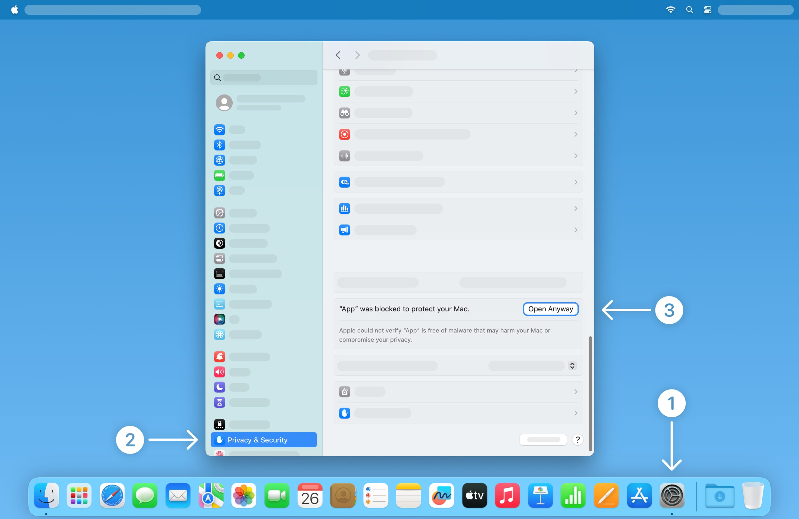
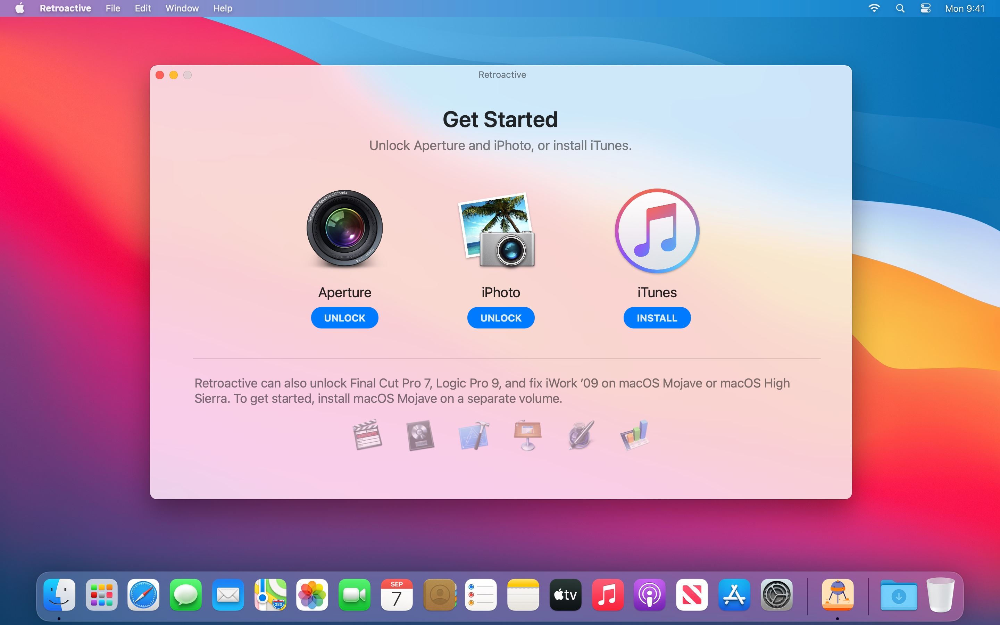
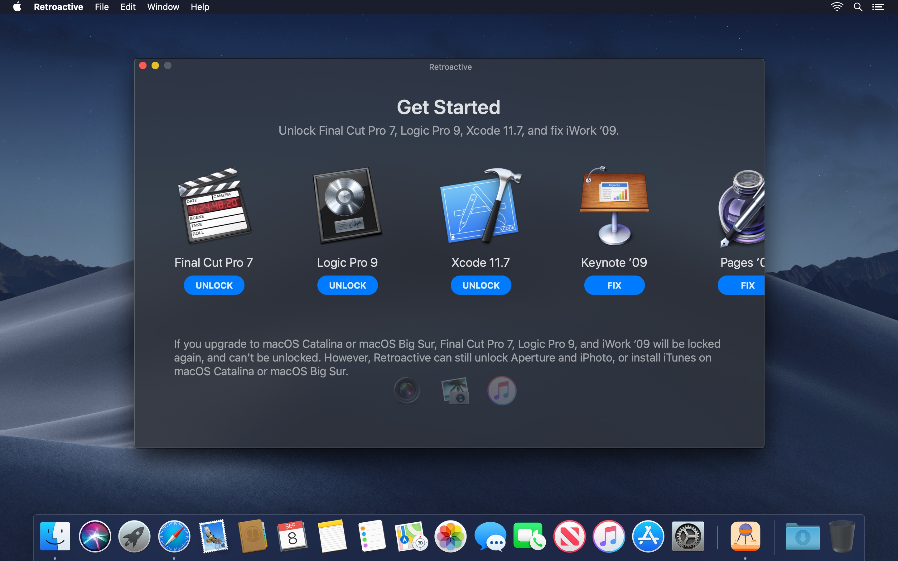
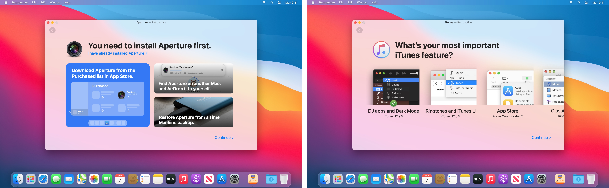
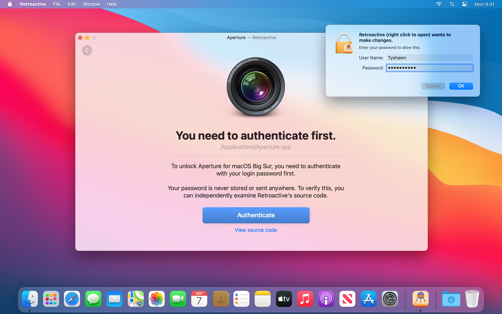
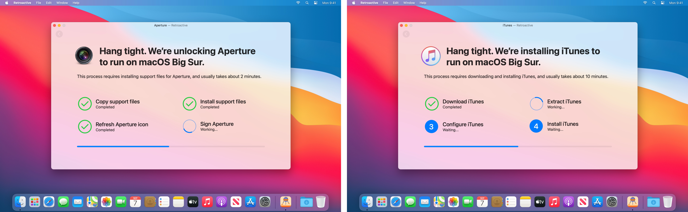
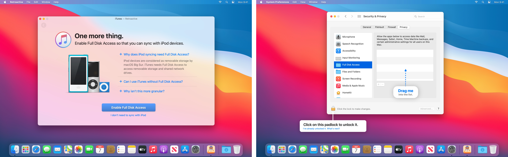
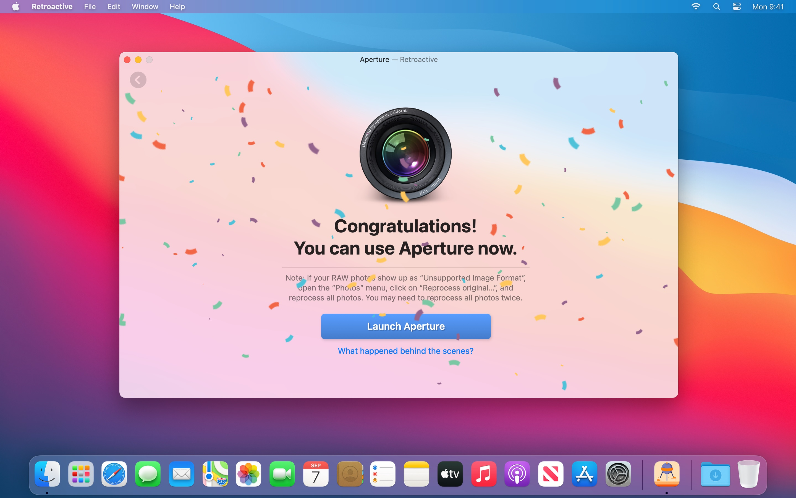
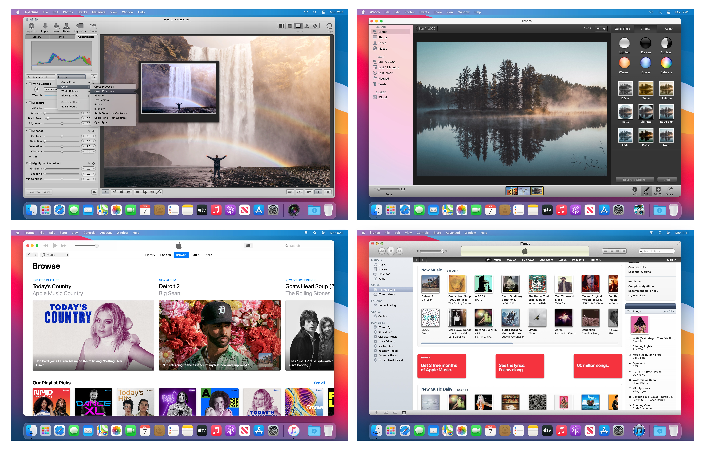
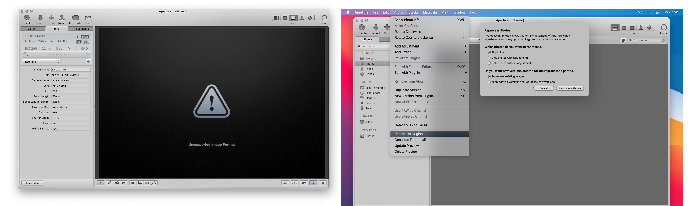

# Retroactive (回溯 3.0)

---

### **我不是原作者, 我不是原作者, 我不是原作者,** 因爲個人項目 ITM 間接用到 Retroactive, 且 RA 沒有存檔 iTunes 安裝包, 所以我把它複製了一次避免某天下載服務器關停

### **I am not the original author, I am not the original author, I am not the original author.** Because my personal project ITM indirectly uses Retroactive, and RA doesn't archive the iTunes.pkg, I copied it to avoid the download server shutting down someday.

---

## 使用方法:

> 只着重寫如何使用它來爲新版OSX安裝 iTunes, 更多內容可以查看下方原 README

原 Readme 在 [此處](https://github.com/qimuan7/Retroactive-OfflineArchive/blob/1/README_EN-Original.md)

### Release 中的文件是什麼? :

- **Retroactive.3.0.zip** : Retroactive 安裝包, 下載解壓然後拖進應用文件夾即可使用

- **iTunes12.6.5.dmg** : iTunes 12.6.5 安裝包, OSX10.13以上需要配合 Retroactive 安裝

- **InstallESDDmg.zip.001/002/003** : **分卷壓縮的** iTunes 12.9.5.5 安裝包, OSX10.15以上需要配合 Retroactive 安裝 (至於爲什麼這麼大後面會解釋)

- **iTunes_BigSurLiked-icon.icns** : iTunes 的方圖標, 安裝在OSX11或以上圓形看起來不和諧的話可以用它替換 (換圖標只需要點一下對應的文件, 然後點Cmd+i, 將圖標拖到彈出詳情的左上角那個文件圖標上就好)

---

**以下都是我自己嘗試和總結的, 儘管我在 x64 的 MBP 2017 上測試過, 但不保證 100% 能用, 不能用的話還是老老實實跟原方法吧**

---

### A.下載並安裝 iTunes 12.9.5.5

1.從 Release 下載 Retroactive.3.0.zip , 隨後雙擊解壓縮, 並將解壓的 .app 文件拖到系統 "應用程式(Applications)" 文件夾

2.1. 下載**三個** InstallESDDmg.zip.00X (001, 002, 003), 一共 5GB+, 確認全部下載, 並放在同一目錄下

2.2. 使用類似 7zip, Maczip, 或其他**可以解壓分卷壓縮**的應用解壓三個中的任一, 稍等便可得到名爲 InstallESDDmg.pkg

> 分卷壓縮就是把一個大文件切成幾份, 要還原的時候再拼起來, 壓縮應用就是這個負責分分合合的工具, 需要所有文件都在一個目錄下不然壓縮應用找不到某個部分就會失敗

3. 打開 Retroactive, 選 "iTunes" 選項, 然後放着 Retroactive, 轉戰 Finder

> 此時如果你繼續點下一步的話, 會觸發網上下載, 速度較慢但 100% 成功, 但我寫這段是爲了在沒網的情況下也能用, 所以沒跟原 README 的使用方法

4. 打開 Finder, 按下 "Cmd+," (逗號), 在從側邊欄中勾選 MMachintosh HD 電腦硬盤 (叫其他名同理, 側邊欄顯示本機硬盤就好), 退出選項

> "Cmd+," (逗號) 是快速打開對應app的設定選項, 選擇 Finder 就會開啓 Finder 的選項

5. 點開 Finder 側邊欄中的本機硬盤目錄, 然後按下 "Cmd+Shift+." (句號), 這時你會看到目錄多了一堆灰色文件夾, 這是隱藏文件, 找到下方的 "tmp" 文件夾, 點開它, 然後把 InstallESDDmg.pkg 丟進去

> "Cmd+Shift+." (句號) 是 Finder 顯示隱藏文件的快捷鍵, 按一下顯示, 再按一下隱藏, tmp 是臨時數據文件夾, 平時隱藏, 但 Retroactive 會把文件下載到這裏, 我們把下載好的文件放進去它就會跳過下載直接安裝

6. 現在回到 Retroactive, 選擇下一步, 在版本選擇中選取 "12.9.5.5", 也就是默認選項, 然後按下一步, 不出意外 iTunes 應該很快會安裝完

> 12.9.5.5 是在OSX上能安裝的最新版本, 這是移植了 OSX10.14 的 iTunes, 但 10.14 的 iTunes 內置在系統裏, 所以 InstallESDDmg.pkg 其實是完整的OSX10.14系統還原鏡像, 但只解壓其中的 iTunes 做移植, 其他都沒用. 我也嘗試過只把它解壓出來或者精簡這個鏡像, 但失敗了, Retroactive 只認這個 5GB+ 的文件, 所以沒招只能把它放上來, 不想要這麼大的可以用 12.6.5, 但界面可能會有一點點出錯 (功能不影響就是不太美觀)

7. 確認安裝完成並且能打開後, 回到 tmp 目錄把 InstallESDEmg.pkg 和 Retroactive 文件夾刪掉, 返回硬盤目錄再按一次 "Cmd+Shift+." (句號), 好了你可以用 iTunes 了

> 刪掉是避免 tmp 不會自動清理, 但理論上重啓或者垃圾清理工具會清理這個目錄, 所以點開用 iTunes 吧

---

### B.下載並安裝 iTunes 12.6.5

1.從 Release 下載 Retroactive.3.0.zip , 隨後雙擊解壓縮, 並將解壓的 .app 文件拖到系統 "應用程式(Applications)" 文件夾

> 這步是一樣的

2. 下載 iTunes12.6.5.dmg

3. 打開 Retroactive, 選 "iTunes" 選項, 然後放着 Retroactive, 轉戰 Finder

> 此時如果你繼續點下一步的話, 會觸發網上下載, 速度較慢但 100% 成功, 但我寫這段是爲了在沒網的情況下也能用, 所以沒跟原 README 的使用方法

4. 打開 Finder, 按下 "Cmd+," (逗號), 在從側邊欄中勾選 MMachintosh HD 電腦硬盤 (叫其他名同理, 側邊欄顯示本機硬盤就好), 退出選項

> "Cmd+," (逗號) 是快速打開對應app的設定選項, 選擇 Finder 就會開啓 Finder 的選項

5. 點開 Finder 側邊欄中的本機硬盤目錄, 然後按下 "Cmd+Shift+." (句號), 這時你會看到目錄多了一堆灰色文件夾, 這是隱藏文件, 找到下方的 "tmp" 文件夾, 點開它, 然後把 iTunes12.6.5.dmg 丟進去

> "Cmd+Shift+." (句號) 是 Finder 顯示隱藏文件的快捷鍵, 按一下顯示, 再按一下隱藏, tmp 是臨時數據文件夾, 平時隱藏, 但 Retroactive 會把文件下載到這裏, 我們把下載好的文件放進去它就會跳過下載直接安裝

6. 現在回到 Retroactive, 選擇下一步, 在版本選擇中選取 "12.6.5", 也就是默認選項右邊那一個, 然後按下一步, 不出意外 iTunes 應該很快會安裝完

> 12.6.5 的部分選單顯示可能會有一點點白框或者其他怪怪的問題, 不過功能正常, 這是 iTunes 最後一個能用 iTunesU 和下載應用的版本(似乎是), 我也不懂作者爲何不加 iTunes 12.8.3 的適配, 輕量的同時比 12.6.5 新一些, 不過我沒能力開發或修改 (不是說有問題只是不太明白).

7. 確認安裝完成並且能打開後, 回到 tmp 目錄把 iTunes12.6.5.dmg 和 Retroactive 文件夾刪掉, 返回硬盤目錄再按一次 "Cmd+Shift+." (句號), 好了你可以用 iTunes 了

> 刪掉是避免 tmp 不會自動清理, 但理論上重啓或者垃圾清理工具會清理這個目錄, 所以點開用 iTunes 吧

---

## 教程結束, 跟着是原 README 的中文翻譯

---

您可以使用 Retroactive 在 macOS Golden Gate、macOS Tahoe、macOS Sequoia、macOS Sonoma、macOS Ventura、macOS Monterey、macOS Big Sur 和 macOS Catalina 上運行 Aperture、iPhoto 和 iTunes。在 macOS Mojave 上執行 Xcode 11.7。在 macOS Mojave 或 macOS High Sierra 上執行 Final Cut Pro 7、Logic Pro 9 和 iWork ’09。

<a href="https://github.com/cormiertyshawn895/Retroactive/releases/download/3.0/Retroactive.3.0.zip" alt="下載 Retroactive">

---

### 打開 Retroactive

下載 Retroactive 後，雙擊即可開啟。 macOS 可能會提示「Retroactive 無法打開，因為它來自未識別的開發者。」這是正常現象。

要開啟 Retroactive，請前往“系統設定”>“隱私與安全性”，然後向下捲動並點擊“仍然開啟”。

Retroactive 不會損害您的 Mac。出現此警告的原因是 Retroactive 未經公證。 Retroactive 是開源軟體，因此您可以隨時查看其原始程式碼以確保其安全性。

---

## 從 Aperture、iPhoto、iTunes 和 Final Cut Pro 7 過渡到支援的應用程式

由於 [Rosetta 2 將從 macOS 28 中移除](https://support.apple.com/102527)，macOS Golden Gate 很可能是¹ 最後一個支援透過 Retroactive 運行 Aperture、iPhoto 和 iTunes 的 macOS 版本。

升級到 macOS 28 後，您需要從 Aperture、iPhoto 和 iTunes 過渡到一系列受支援的應用程序，其中許多應用程式已內建於 macOS 或可免費下載。

#### iTunes

-切換到[音樂](https://support.apple.com/guide/music/welcome/mac)、[電視](https://support.apple.com/guide/tvapp-mac/welcome/mac)、[Podcast](https://suppor t.apple.com/guide/podcasts/welcome/mac)、[圖書](https://support.apple.com/guide/books/welcome/mac)和[Finder](https://support.apple.com/102471)。

- 使用[Parallels Desktop](https://www.parallels.com/products/desktop)或[VMware Fusion](https://www.vmware.com/products/fusion.html)安裝Windows，然後下載[適用於Windows的iTunes](https://apps.microsoft.com/detail/9

- 要歸檔 iPhone 和 iPad 應用，請使用 [Asspp](https://github.com/Lakr233/Asspp)、[IPATool](https://github.com/majd/ipatool)、[iMazing](https://imazing.com)、[Apple Configurator](https://apps.app37413213721321370321321337330373333333333) [(教學)](https://raw.githubusercontent.com/cormiertyshawn895/Retroactive/master/Retroactive/Support/ConfiguratorTutorial.mp4) 或 [適用於 Windows 的 iTunes 12.6.5.3](https://secure-appldnld.apple.com/itunes12/091-87819-20180912-69177170-B085-11E8-B6AB-C1D03409AD2A6/Setiunes)。

#### Aperture 和 iPhoto

- 請切換到 [照片](https://support.apple.com/guide/photos/welcome/mac)、[Darktable](https://www.darktable.org) 或 [RawTherapee](https://www.rawtherapee.com)。

- 購買或訂閱 [AfterShot Pro](https://www.aftershotpro.com)、[Capture One Pro](https://www.captureone.com)、[Darkroom](https://apps.apple.com/app/id953286746)、[DxO PhotoLab](https://www.dxo.com/dxo-photolab)、[Lightroom](https://apps.apple.com/app/id1451544217)、[Lightroom Classic](https://www.adobe.com/products/photoshop-light1544217)、[Lightroom Classic](https://www.adobe.com/products/photoshop- [Photomator](https://apps.apple.com/app/id1444636541)。

#### Final Cut Pro 7

- 在相容的 Mac 上將您的專案匯出為 XML 檔案。然後將它們匯入 [DaVinci Resolve](https://www.avid.com/media-composer) 或 [Premiere Pro](https://www.adobe.com/products/premiere.html)。您也可以使用 [SendToX](https://apps.apple.com/app/id496926258) 將它們匯入到最新版本的 [Final Cut Pro](https://apps.apple.com/app/id424389933)。

¹ 理論上，可以透過修改 Aperture、iPhoto 和 iTunes，讓 macOS 28 將它們視為較舊的、不再維護的遊戲，這些遊戲將繼續在 Rosetta 的部分功能下運作。

由於 Aperture、iPhoto 和 iTunes 可能依賴超出此子集範圍的框架，因此可能需要使用 [dsce](https://github.com/moraea/dsce) 從 macOS Golden Gate 的 dyld 共享緩存中提取 x86_64 框架來增強 Aperture、iPhoto 和 iTunes 的功能。

---

### 選擇應用

在 macOS Golden Gate、macOS Tahoe、macOS Sequoia、macOS Sonoma、macOS Ventura、macOS Monterey、macOS Big Sur 和 macOS Catalina 上，Retroactive 可以解鎖 Aperture 和 iPhoto，或安裝 iTunes。選擇您想要運行的應用程式。如果您想從此處運行多個應用，請選擇其中任何一個。您之後始終可以返回此畫面。

在 macOS Mojave 和 macOS High Sierra 系統上，Retroactive 還可以解鎖 Final Cut Pro 7、Logic Pro 9（實驗性功能）、Xcode 11.7（需要 macOS Mojave 系統），並修復 iWork ’09。

我將以 Aperture 為例，但同樣的方法也適用於 iPhoto、iTunes、Final Cut Pro 7 和 Logic Pro。支援 Logic Pro 9、Xcode 11.7 和 iWork ’09。

---

### 尋找應用程式或選擇版本

Retroactive 會自動掃描您的 Mac，尋找已安裝的 Aperture、iPhoto、Final Cut Pro 7、Logic Pro 9、Xcode 11.7 或 iWork ’09。如果 Retroactive 已找到您想要運行的應用程式，請跳至下一部分。

如果 Retroactive 找不到已安裝的應用程式，系統會提示您下載或從 DVD 光碟重新安裝。您也可以在您擁有的另一台 Mac 上找到該應用程式，然後透過隔空投送 (AirDrop) 將其傳輸到這台 Mac，或從 Time Machine 備份中還原該應用程式。

如果您選擇 iTunes，Retroactive 會詢問您要安裝哪個版本，然後自動下載並安裝您。

- iTunes 12.9.5 支援深色模式和大多數 DJ 應用程式。

- iTunes 12.6.5 支援鈴聲和 iTunes U。

- iTunes 11.4 採用經典介面。

- iTunes 10.7 支援 CoverFlow。

如果您不知道要安裝哪個版本，請保留預設設定並點擊「繼續」。

---

### 驗證 Retroactive

若要安裝或修改您選擇的應用程式，您需要先使用登入密碼進行驗證。點擊“驗證”，然後輸入您的登入密碼。

您的密碼絕不會被儲存或發送到任何地方。您可以查看 Retroactive 的源代碼來驗證這一點。

---

### 修改應用

Retroactive 將安裝或修改您選擇的應用。修改應用大約需要 2 分鐘。

如果您選擇安裝 iTunes，則此過程可能會更長。

- 根據您選擇的版本，安裝可能需要 10 分鐘到 1 小時。

- 安裝過程中風扇運轉是正常現象。

- 如果 Retroactive 再次要求您輸入登入密碼，請重新輸入。

- 如果 iTunes 12.9.5 無法安裝，請嘗試安裝 iTunes 12.6.5。

安裝 iTunes 後，Retroactive 會詢問您是否要同步 iPod。如果您需要與 iPod 裝置同步，請點選“啟用完全磁碟存取權限”，然後依照 Retroactive 提供的畫面說明進行操作。

完成！您現在可以使用該應用程式了。

---

### 使用應用

成功修改或安裝應用程式後，您可以盡情體驗它的各項功能。

- 除了播放影片、匯出幻燈片、照片串流和 iCloud 照片分享之外，Aperture 的所有功能都應該可用。如果 RAW 照片無法打開，[您需要重新處理它們](https://github.com/cormiertyshawn895/Retroactive#reprocessing-raw-photos-in-aperture)。

- 除了播放影片、匯出幻燈片、照片串流和 iCloud 照片分享之外，iPhoto 的所有功能都應該可用。

- 所有功能都應該適用於 iTunes 12.9.5。

- 大多數功能應該適用於 iTunes 12.6.5。請使用 iTunes 12.9.5 或 Finder 備份您的裝置。使用 [Apple Configurator 2](https://apps.apple.com/app/apple-configurator-2/id1037126344) 在 Mac 上下載 iOS 應用程式。

- 從 iTunes Store 下載的電影和電視節目可能無法在 iTunes 中播放。請改用 TV 應用程式下載或播放。

- iTunes 中的某些對話方塊可能會顯示帶有叉的 iTunes 圖示。這只是顯示問題，不影響功能。

- Final Cut Pro 7 的所有功能應該都能正常運作。

- 對 Logic Pro 9 的支援尚處於實驗階段。您可能會遇到頻繁的卡頓和崩潰。

- Xcode 11.7 的大部分功能應該都能正常運作。

- 修正 iWork ’09 後，格式欄中的文字格式和段落對齊控制項應該能夠正確顯示。捲軸將不再出現在文件畫布的後面。

- 使用 Retroactive 修復 Keynote ’09 後，您可以正常播放投影片。

- 使用 Retroactive 修復 Pages ’09 後，Pages ’09 中的輸入和滾動操作應該會更加流暢。

---

### 與裝置同步

如果您將 Apple 裝置連接到 Mac，但在 iTunes 中看不到任何內容，或顯示「此裝置正被此電腦上的其他使用者使用」：

- 中斷裝置與 Mac 的連接，但保持 iTunes 開啟。

- 點選選單列上的 Spotlight 圖示（放大鏡）。

- 輸入「終端」並按下回車鍵開啟終端應用程式。

- 在終端機視窗中輸入 `killall AMPDevicesAgent` 並按下回車鍵。

- 將 Apple 裝置重新連接到 Mac。

如果您將 Apple 裝置連接到 Mac，並看到「iTunes 無法讀取裝置內容。請前往裝置偏好設定中的『摘要』標籤頁，然後點擊『恢復』將此裝置還原到原廠設定」：

- 您可能安裝了 Retroactive 1.4 或更早版本的 iTunes。

- 重新安裝 iTunes（使用最新版本的 Retroactive）後，iTunes 應該可以正常讀取裝置內容。

- 安裝過程結束時，Retroactive 會詢問您是否要同步 iPod。如果您需要與 iPod 裝置同步，請點選「啟用完全磁碟存取權限」。

如果您嘗試為 iPod shuffle 啟用 VoiceOver，但看到「iTunes 無法安裝 VoiceOver 套件。未知原因」：發生錯誤 (1701)：

- [在此處直接下載 VoiceOver 1.4.2 安裝程式](https://swdist.apple.com/content/downloads/29/37/041-91732-A_LSWLP6NLRV/bk8l36k29x8d146doiwcvuv8qemu3mOxRkqemu3m

- 安裝下載的 VoiceOver.pkg 檔案。

- 退出並重新開啟 iTunes。

---

### 下載 iOS 應用

自 2020 年 4 月起，您需要使用 [Apple Configurator 2](https://apps.apple.com/app/apple-configurator-2/id1037126344) 在您的裝置上下載 iOS 應用程式。 Mac](https://www.youtube.com/watch?v=M_3t06FEhR0).

---

### Final Cut Pro 7 與 Apple Pro 影片格式更新

如果您透過軟體更新安裝了 Apple Pro 視訊格式更新，您可能需要[按照以下說明操作](https://github.com/cormiertyshawn895/Retroactive/issues/130#issuecomment-724078303)來重新啟用 Final Cut Pro 7。

---

### 在 Aperture 中重新處理 RAW 照片

- 在 Aperture 中，如果您的 RAW 照片顯示為“*不支援的圖像格式*”，請開啟“*照片*”選單，點擊“*重新處理原始…*”，然後重新處理所有照片。重新處理 RAW 照片後，您將能夠像以前一樣預覽和調整它們。

💡 提示：

- 如果部分 RAW 照片在重新處理後仍顯示為“*不支援的影像格式*”，請重複上述步驟重新處理所有照片。換句話說，您可能需要重新處理所有照片兩次。

---

### 在 VMware Fusion 中安裝 Final Cut Pro 7 的變通方法

如果您沒有 2019 年底之前發布的 Mac，您仍然可以在 VMware Fusion 中安裝 Final Cut Pro 7，並將現有的 Final Cut Pro 7 專案匯出為 XML 檔案。這樣，SendToX、DaVinci Resolve、Media Composer 和 Premiere Pro 就可以開啟這些檔案。

- [使用 VMware Fusion 安裝 macOS Mojave 虛擬機器](https://www.huibdijkstra.nl/how-to-set-up-a-osx-mojave-vm-in-vmware-fusion/)。其他虛擬機器軟體（例如 Parallels Desktop）不受支持，無法正常運作。

- 在 VMware Fusion 中掛載 Final Cut Studio 安裝程式後，以滑鼠右鍵按一下「安裝 Final Cut」。 Studio.pkg > 顯示原始文件，然後將 FinalCutStudio.mpkg 和 Packages 複製到 VMware Fusion 的桌面

- 右鍵點選複製的 FinalCutStudio.mpkg > 顯示包內容 > 資源

- 右鍵點選 Requirements Checker.app > 顯示包內容 > 內容 > 資源

- 刪除 minsys.plist

- 雙擊修改後的 FinalCutStudio.mpkg 開始安裝

- 照常使用 Retroactive

若要使用時間軸和預覽等編輯功能，請在 2019 年底之前發布的舊款 Mac 上安裝 macOS Mojave，然後照常執行 Retroactive。

---

### 最後說明

- 如果 GateKeeper 阻止您執行所選應用程式的修改版本，請使用 `sudo spctl --master-disable` 指令在終端機中暫時停用 GateKeeper。

- 了解更多資訊追溯性工作，[深入了解技術細節](https://medium.com/@cormiertyshawn895/deep-dive-how-does-retroactive-work-95fe0e5ea49e)。
